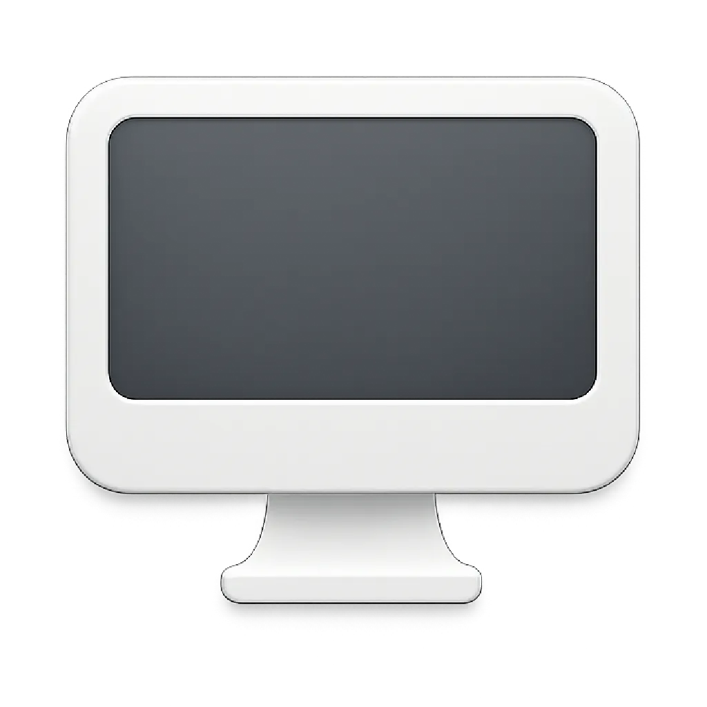

# HideDesktop / 桌面图标隐藏工具

A clean macOS desktop icon hiding tool to help you get a more refreshing desktop experience.
一个简洁的 macOS 桌面图标隐藏工具，帮助您获得更清爽的桌面体验。



## Features / 功能特性

- 🖥️ **One-click hide/show desktop icons** - Quickly toggle desktop icon display status / **一键隐藏/显示桌面图标** - 快速切换桌面图标的显示状态
- 🎯 **Status bar menu integration** - Convenient status bar icon and menu / **状态栏菜单集成** - 方便的状态栏图标和菜单
- �� **Multi-language support** - Supports Chinese and English interfaces / **多语言支持** - 支持中文和英文界面
- 🚀 **Startup on boot** - Supports setting automatic startup on boot / **开机启动** - 支持设置开机自动启动
- 💾 **Status memory** - Automatically saves your preference settings / **状态记忆** - 自动保存您的偏好设置
- 🎨 **Clean interface** - Simple and intuitive user experience / **简洁界面** - 简单直观的用户体验

## System Requirements / 系统要求

- macOS 15.5 or later / macOS 15.5 或更高版本
- Apple Silicon (M1/M2/M3) or Intel processor / Apple Silicon (M1/M2/M3) 或 Intel 处理器

## Installation / 安装方法

### Build from source / 从源码构建

1. Clone this repository / 克隆此仓库：
   ```bash
   git clone https://github.com/Abelliuxl/HideDesktop.git
   ```

2. Open the project with Xcode / 使用 Xcode 打开项目：
   ```bash
   cd HideDesktop
   open HideDesktop.xcodeproj
   ```

3. Select the target device in Xcode, then click the Run button to build the project / 在 Xcode 中选择目标设备，然后点击运行按钮构建项目。

4. After building is complete, you can find `HideDesktop.app` in the `build/Build/Products/Release/` directory / 构建完成后，您可以在 `build/Build/Products/Release/` 目录下找到 `HideDesktop.app`。

5. Drag the app to the `Applications` folder / 将应用拖拽到 `应用程序` 文件夹中。

## Usage / 使用方法

1. Launch HideDesktop app / 启动 HideDesktop 应用
2. Click the HideDesktop icon in the menu bar / 点击菜单栏中的 HideDesktop 图标
3. Select the corresponding function / 选择相应功能：
   - **Hide desktop icons** - Immediately hide all desktop icons / **隐藏桌面图标** - 立即隐藏所有桌面图标
   - **Show desktop icons** - Restore display of all desktop icons / **显示桌面图标** - 恢复显示所有桌面图标
   - **Startup on boot** - Set the app to start automatically on boot / **开机启动** - 设置应用在开机时自动启动
   - **Language switch** - Switch between Chinese and English interfaces / **语言切换** - 在中文和英文界面之间切换

## Tech Stack / 技术栈

- **SwiftUI** - Modern user interface framework / 现代化的用户界面框架
- **Swift** - Powerful programming language / 强大的编程语言
- **AppKit** - macOS native application framework / macOS 原生应用框架
- **SMAppService** - macOS startup management / macOS 开机启动管理

## License / 许可证

This project is licensed under **CC BY-NC-SA 4.0**.
本项目采用 **CC BY-NC-SA 4.0** 许可证。

- ✅ **Allowed / 允许**: Use, modify, distribute, share / 使用、修改、分发、共享
- ❌ **Prohibited / 禁止**: Commercial use, profit-making / 商业用途、盈利
- 📋 **Required / 要求**: Attribution, share-alike / 署名、相同方式共享

For more details, please see the [LICENSE](LICENSE) file / 详细信息请查看 [LICENSE](LICENSE) 文件。

## Contributing / 贡献

Issues and Pull Requests are welcome! / 欢迎提交 Issue 和 Pull Request！

1. Fork this repository / Fork 本仓库
2. Create your feature branch / 创建您的特性分支 (`git checkout -b feature/AmazingFeature`)
3. Commit your changes / 提交您的更改 (`git commit -m 'Add some AmazingFeature'`)
4. Push to the branch / 推送到分支 (`git push origin feature/AmazingFeature`)
5. Open a Pull Request / 打开一个 Pull Request

## Changelog / 更新日志

### v1.1.0
- ✨ Added startup on boot feature / 新增开机启动功能
- 🌐 Improved multi-language support / 改进多语言支持
- 🎨 Optimized user interface / 优化用户界面
- 🐛 Fixed known issues / 修复已知问题

### v1.0.0
- 🎉 Initial release / 初始版本发布
- 🖥️ Basic desktop icon hide/show functionality / 基本的桌面图标隐藏/显示功能
- 🎯 Status bar menu integration / 状态栏菜单集成

## Contact / 联系方式

- Project URL / 项目地址：[https://github.com/Abelliuxl/HideDesktop](https://github.com/Abelliuxl/HideDesktop)
- Issue feedback / 问题反馈：[GitHub Issues](https://github.com/Abelliuxl/HideDesktop/issues)

## Disclaimer / 免责声明

This software is provided "as is" without any express or implied warranties, including but not limited to merchantability, fitness for a particular purpose, and non-infringement. In no event shall the author or copyright holder be liable for any claims, damages, or other liabilities, whether in contract, tort, or otherwise, arising from, out of, or in connection with the software or the use or other dealings in the software.
本软件按"原样"提供，不提供任何明示或暗示的保证，包括但不限于适销性、特定用途适用性和非侵权性的保证。在任何情况下，作者或版权持有人均不对任何索赔、损害或其他责任负责，无论是在合同、侵权或其他方面，由软件或软件的使用或其他交易引起、产生或与之相关。

---

**Note / 注意**: This software is intended for personal learning and non-commercial use only. For commercial cooperation, please contact the author / 本软件仅供个人学习和非商业用途使用。如需商业合作，请联系作者。
